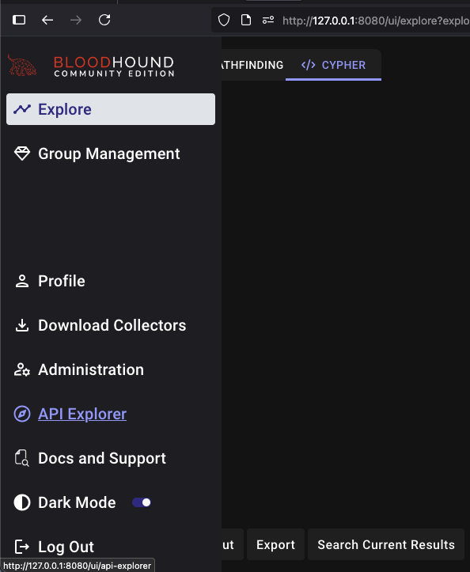
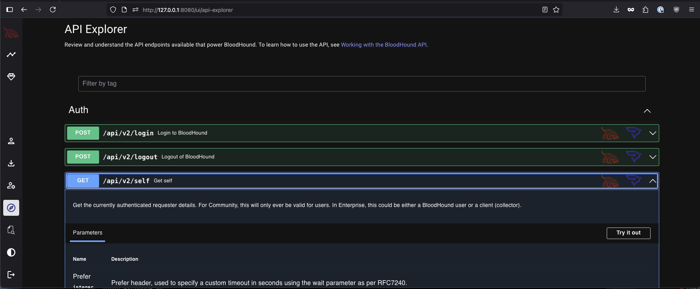
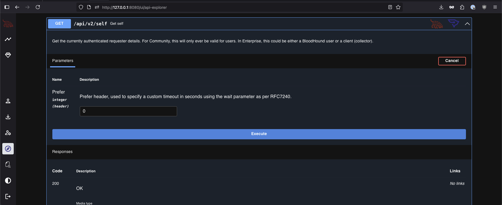
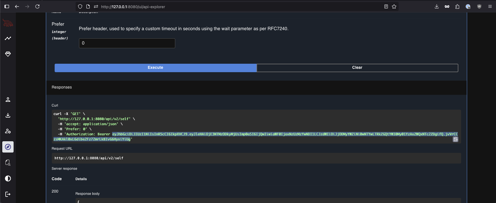

# Customqueries-converter
This Repo contains steps to convert BloodHound Legacy Customqueries.json to the new format used by BloodHound Community Edition (BHCE)

## Acknowledgments
This method is inspired by [REDSEERcurity Spotlight](https://medium.com/seercurity-spotlight) Blog Post [Make Bloodhound Cool Again: Migrating Custom Queries from Legacy BloodHound to BloodHound CE](https://medium.com/seercurity-spotlight/make-bloodhound-cool-again-migrating-custom-queries-from-legacy-bloodhound-to-bloodhound-ce-83cffcfe5b64) 

I tried their method and got an error message, so I decided see if ChatGPT could help figure out the error. 

## Locate your Legacy Custom Queries 

You will need your `customqueries.json` file. It can be found in a specific folder on each OS
- Windows : C:\Users\[USERNAME]\AppData\Roaming\BloodHound\customqueries.json
- MacOS : /Users/[USERNAME]/Library/Application Support/bloodhound/customqueries.json
- Linux : ~/.config/bloodhound/customqueries.json
  
Alternatively you can use one of the `customqueries.json` file that are available on GitHub. 
- [Hausec](https://github.com/hausec/Bloodhound-Custom-Queries/blob/master/customqueries.json)
- [ZephrFish](https://github.com/ZephrFish/Bloodhound-CustomQueries/blob/main/customqueries.json)
- [Compass Security](https://github.com/CompassSecurity/BloodHoundQueries/blob/master/BloodHound_Custom_Queries/customqueries.json)

**NOTE**: For your convinience, I have added a version of those 3 customqueries.json in the new format in the [customqueries](./customqueries) folder of this repo. You can skip the convertion step if you used any of those files.

## Converting to the new Format

Convert your Legacy json into a format BHCE's API can consume.  
The `jq` query bellow will:
- Ignore the queries that have selectors in them (they use the `"final": false` for the first query)
- Make sure the query as a name
- Write a file named `bhce_customqueries.json`

``` bash
jq '[.queries[] | . as $parent | .queryList[] | select(.final) | {name: (.title // $parent.name), query: .query, description: $parent.name}]' customqueries.json > bhce_customqueries.json
```

## Prepare to Use the API
In your BHCE instance, grab the `JWT Bearer token`

**NOTE**: JWT Bearer token are usefull for single usage like in this case. If you want to built a reliable integration, you should use an API Key. 

1. Navigate the to `API Explorer` page



2. Expend a `GET` method such as `/api/v2/self` and click on the `Try it out` button




3. Click on `Execute`



4. In the `Curl` request, copy the value after the `Bearer` word. It should start with `ey`



## Upload the JSON to BHCE

If you are using Windows or PowerShell click [here](README.md#Windows)
### For Linux and MacOS

Modify the following bash script
- Make sure you have the right URL in `API_URL`
- Replace `"eyJhb..."` with the actual JWT Token you found in the previous step
- Save the script to a file like `up_queries.sh`

``` bash
#!/bin/bash

# Path to valid CE formatted JSON file
INPUT_FILE="newformat_customqueries.json"

# API endpoint and token
#For quick tests or one-time calls, the JWT used by your browser may be the simplest route. 
#The API will accept calls using the following header structure in the HTTP request:
#'Authorization': Bearer $JWT_TOKEN
#If you open the Network tab within your browser, you will see calls against the API made utilizing this structure.

API_URL="http://localhost:8080/api/v2/saved-queries"
JWT_TOKEN="eyJhb..." 

# Loop through each query and upload
jq -c '.[]' "$INPUT_FILE" | while read -r query; do
 curl -X POST \
 "$API_URL" \
 -H "Content-Type: application/json" \
 -H "Authorization: Bearer $JWT_TOKEN" \
 --data-raw "$query"
echo "" 
done
```

In your terminal run the following command to upload the queries : `bash up_queries.sh`

### Windows

Modify the following bash script
- Make sure you have the right URL in `API_URL`
- Replace `"eyJhb..."` with the actual JWT Token you found in the previous step
- Save the script to a file like `up_queries.ps1`
- 
``` PowerShell
$InputFile = "bhce_customqueries.json"
$ApiUrl = "http://localhost:8080/api/v2/saved-queries"
$JwtToken = "eyJhb..."

$Queries = Get-Content $InputFile | ConvertFrom-Json

foreach ($Query in $Queries) {
    if (-not $Query.name -or -not $Query.query) {
        Write-Warning "Skipping entry with missing 'name' or 'query'"
        continue
    }

    # Rebuild object with correct field names
    $JsonPayload = [pscustomobject]@{
        name        = $Query.name
        query       = $Query.query
        description = $Query.description
    } | ConvertTo-Json -Depth 5 -Compress

    Invoke-RestMethod -Method Post -Uri $ApiUrl `
        -Headers @{ 
            "Content-Type"  = "application/json"; 
            "Authorization" = "Bearer $JwtToken" 
        } `
        -Body $JsonPayload

    Write-Host ""
}
```


## Conclusion

This was tested using BloodHound Legacy Version: 4.3.1 and [BloodHound-CE](https://github.com/SpecterOps/BloodHound) v8.0.0 on MacOS with [PowerShell Core](https://learn.microsoft.com/en-us/powershell/scripting/install/installing-powershell?view=powershell-7.5)
